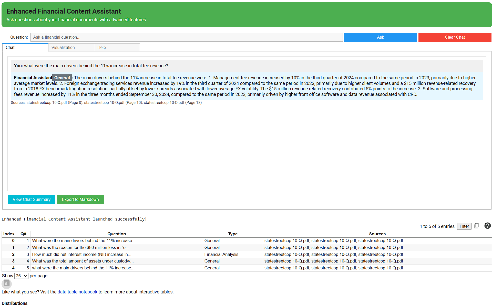
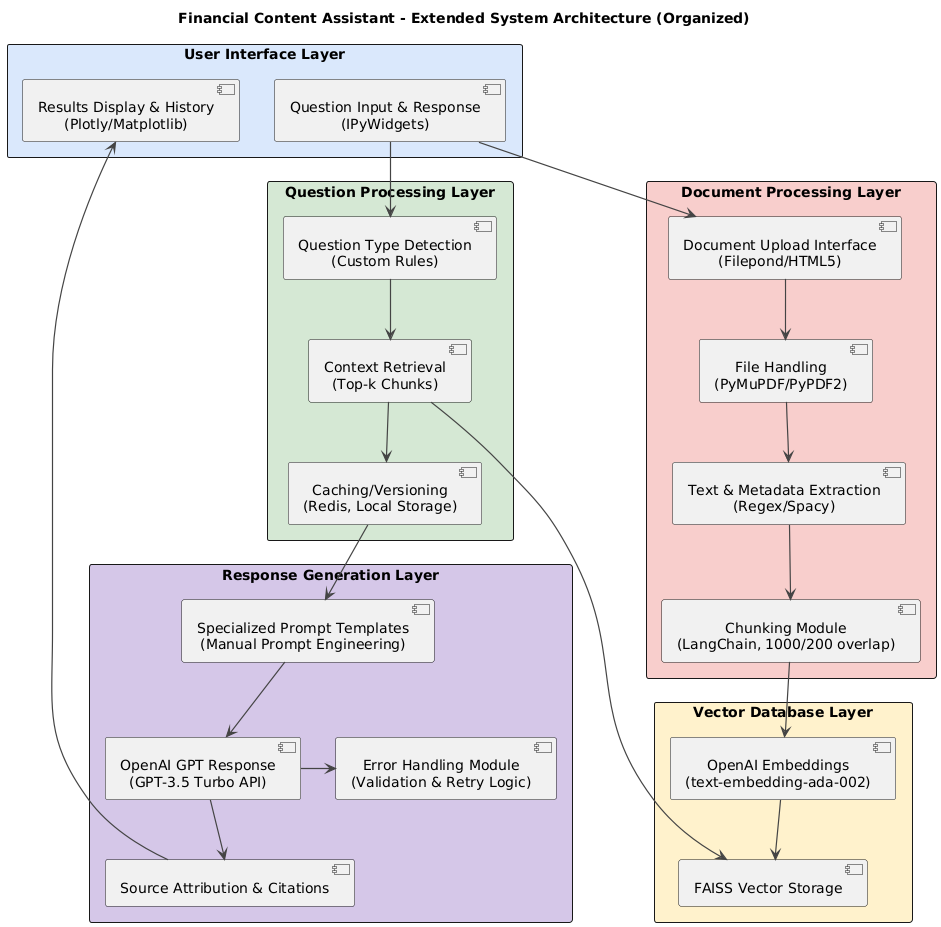

# Financial Content Assistant

A sophisticated financial document analysis system using Retrieval-Augmented Generation (RAG).

## Overview

The **Financial Content Assistant** allows users to upload financial documents (PDFs, TXT, CSV, XLSX) and ask natural language questions.  
It uses **semantic search** and **vector embeddings** to retrieve relevant chunks, and **generates accurate, context-aware answers** with source attribution.

Perfect for financial analysts, students, and investors!




## 🚀 Key Features

- 📂 Upload financial documents (PDF, TXT, CSV, XLSX)
- 🔍 Semantic search using OpenAI or HuggingFace embeddings
- 🧠 Financial-domain prompt engineering
- 📊 Data visualization of query patterns
- 🏷️ Intelligent metadata extraction (dates, companies, doc type)
- 🧾 Export Q&A history to Markdown
- 🛡️ Full source attribution for transparency


## 🛠️ Tech Stack

- Python 3.8+
- LangChain (RAG framework)
- OpenAI / HuggingFace Embeddings
- FAISS or Chroma (Vector DB)
- IPython Widgets (UI)
- pandas, matplotlib


## 🏛️ System Architecture



**Layers:**
- **Document Processing**: Upload, extract, chunk documents
- **Vector Database**: Store document embeddings
- **Question Analysis**: Detect intent, retrieve context
- **Answer Generation**: Create AI-driven responses


*Key components:*
- **Document Processing Layer**: Handles file uploads, text extraction, and chunking
- **Vector Database Layer**: Converts text to embeddings for semantic retrieval
- **Question Processing Layer**: Analyzes question intent and retrieves relevant context
- **Response Generation Layer**: Creates accurate answers with source attribution


## Technical Implementation

The system implements two core generative AI components:

1. **Retrieval-Augmented Generation (RAG)**
   - Document chunking with optimized overlap
   - Vector embeddings using OpenAI
   - FAISS vector database for efficient retrieval
   - Context-aware prompt engineering

2. **Advanced Prompt Engineering**
   - Financial domain-specific prompting
   - Question type detection
   - Context management strategies
   - Source attribution and citation

## Setup Instructions
- You can also run this directly into Google Colab Environment you just need an openai api key
  
### Prerequisites

- Python 3.8+
- OpenAI API key( visit platform.openai.com and sign with your openai account and select 'View API Key' and then 'Create New Secret Key' to generate your new key)


### Installation

1. Clone this repository:
   'git clone https://github.com/NilayRaut/financial_content_assistant.git'
   
   'cd financial-content-assistant'
3. Install required dependencies:
   'pip install -r requirements.txt'
4. Set up your OpenAI API key:
   'export OPENAI_API_KEY="your-api-key-here"'

### Running the Application

#### Option 1: Using Jupyter Notebook
1. Start Jupyter Notebook:
   jupyter notebook 
2. Open `Financial_Content_Assistant.ipynb`
3. Run all cells to launch the interactive interface

#### Option 2: Using Google Colab
1. Upload `Financial_Content_Assistant.ipynb` to Google Colab
2. Run all cells and follow the prompts to enter your API key

### 🧐 How It Works
- Upload your financial documents (.pdf, .txt, .csv, .xlsx)
- Chunks of documents are embedded into a vector space
- Semantic search retrieves relevant content
- AI generates contextual answers with source references
- Visualize your session and export Q&A history
  
## Usage Guide

1. **Upload Documents**: Use the upload functionality to add financial documents
2. **Ask Questions**: Type natural language questions about the documents
3. **View Answers**: Get AI-generated responses with source citations
4. **Analyze Patterns**: Use the visualization tab to see question categories
5. **Export History**: Save your Q&A session as a Markdown file

## Example Questions

- "What was the company's revenue growth in the past year?"
- "Explain the current debt-to-equity ratio and its implications."
- "What are the main risk factors mentioned in the annual report?"
- "How does the cash flow trend compare to industry benchmarks?"
- "What is the company's strategy for addressing market challenges?"
- "What were the top risk factors listed in the 10-K?"
- "Summarize the company's debt-to-equity ratio trends."
- "What was the revenue growth year over year?"
- "How does the company plan to address market volatility?"

## 📊 Visualization Tab
View distribution of your queries: Financial Analysis, Investment Advice, Term Explanation, or General.

## Testing

Run the automated tests to verify functionality:
python tests/test_rag_system.py

## 📂 Project Structure

```plaintext
financial-content-assistant/
├── Financial_Content_Assistant.ipynb     # Main Notebook (UI, RAG Assistant)
├── INFO7375_Financial_Content_Assistant.pdf  # Project Documentation
├── index.html                            # Landing Page (for GitHub Pages)
├── LICENSE                               # Open Source License
├── README.md                             # Project README
├── requirements.txt                      # Project Dependencies
├── sample_data/                          # Sample Financial Documents
│   ├── alphabet 10-k.pdf
│   ├── apple k10 report.pdf
│   ├── meta 10-k.pdf
│   ├── meta 10-q.pdf
│   ├── Microsoft 10-K.pdf
│   ├── Netflix 10-k.pdf
│   └── OECD Economic Outlook.pdf
├── images/                               # Screenshots and Architecture Diagrams
│   ├── Demo.png
│   └── system_architecture.png
├── tests/                                # Test Scripts
│   └── test_rag_system.py
```


## 📢 Future Enhancements
- OCR for scanned PDFs
- Multi-modal search (text, tables, graphs)
- Document summarization
- Streamlit or Gradio web deployment
- Industry benchmark comparison

## 🛡️ Ethical Considerations
- Source attribution on all responses
- Transparency on query type
- Limitations based on document data
- No storage of user-uploaded data


## License

MIT License - see LICENSE file for details.

## Acknowledgments

- OpenAI for embedding and language models
- LangChain for RAG framework
- FAISS for vector storage

## ✨ Author
Developed by Nilay Raut

Empowering smarter financial insights through AI.
